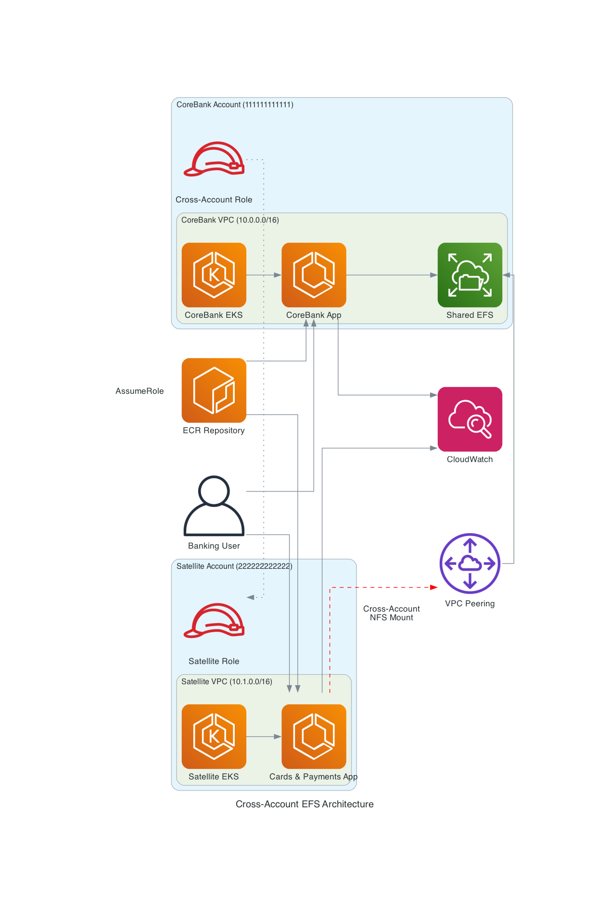
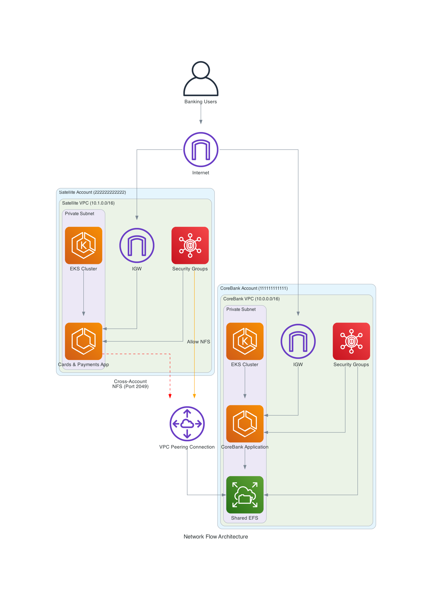

# Mount Amazon EFS File Systems Cross-Account from Amazon EKS

[](https://opensource.org/licenses/MIT)
[](https://aws.amazon.com/)
[](https://kubernetes.io/)

A comprehensive solution for mounting Amazon EFS file systems across AWS accounts from Amazon EKS clusters, specifically designed for banking and financial services with high availability and performance requirements.

## 🏗️ Architecture Overview

This solution implements a **shared storage pattern** where satellite applications directly read and write to a shared CoreBank EFS across AWS accounts, eliminating the need for local storage and ensuring real-time data consistency.

### High-Level Architecture



*Figure 1: Simplified cross-account EFS architecture with CoreBank and one satellite account*



*Figure 2: Network flow between CoreBank and satellite account for EFS access*

### Architecture Components

- **CoreBank Account**: Central hub with shared EFS and primary database
- **Satellite Account**: Cards & Payments services with cross-account EFS access
- **Cross-Account EFS Access**: Secure mounting of CoreBank EFS from satellite accounts
- **Test Applications**: Lightweight Python Flask apps for validation and testing

### Key Features

- **🔗 Shared Storage Pattern**: Satellite apps directly access CoreBank EFS
- **🧪 EFS Testing**: Comprehensive testing of cross-account EFS functionality
- **🔒 Cross-Account Security**: IAM roles and EFS access points with proper authentication
- **📈 High Performance**: Provisioned throughput and optimized mount options
- **🚀 Simple Deployment**: Automated scripts for complete infrastructure setup
- **📊 Comprehensive Testing**: Automated test suite with detailed reporting
- **🌐 Banking-Grade**: Production-ready with compliance and security best practices

## 🎯 Performance Requirements

| Metric | Target | Use Case |
|--------|--------|----------|
| EFS Write Time | < 30 seconds | Financial transaction logging |
| API Response Time (95th percentile) | < 200ms | Real-time banking operations |
| EFS Mount Health Check | < 5 seconds | System availability monitoring |
| Cross-Account Access Latency | < 10 seconds | Inter-service communication |
| Recovery Time Objective (RTO) | < 60 seconds | Disaster recovery |
| Recovery Point Objective (RPO) | < 30 seconds | Data loss tolerance |

## 📋 Prerequisites

### Required Tools

1. **AWS CLI** (v2.0+)
   ```bash
   curl "https://awscli.amazonaws.com/awscli-exe-linux-x86_64.zip" -o "awscliv2.zip"
   unzip awscliv2.zip
   sudo ./aws/install
   ```

2. **kubectl** (v1.28+)
   ```bash
   curl -LO "https://dl.k8s.io/release/$(curl -L -s https://dl.k8s.io/release/stable.txt)/bin/linux/amd64/kubectl"
   sudo install -o root -g root -m 0755 kubectl /usr/local/bin/kubectl
   ```

3. **eksctl** (v0.147+)
   ```bash
   curl --silent --location "https://github.com/weaveworks/eksctl/releases/latest/download/eksctl_$(uname -s)_amd64.tar.gz" | tar xz -C /tmp
   sudo mv /tmp/eksctl /usr/local/bin
   ```

4. **Docker** (for building images)
   ```bash
   curl -fsSL https://get.docker.com -o get-docker.sh
   sudo sh get-docker.sh
   sudo usermod -aG docker $USER
   ```

### AWS Account Setup

Configure two AWS accounts:

1. **CoreBank Account**: Primary account (e.g., 111111111111)
2. **Satellite Account**: Cards/Payments (e.g., 222222222222)

```bash
aws configure --profile corebank
aws configure --profile satellite
```

Verify access:
```bash
aws sts get-caller-identity --profile corebank
aws sts get-caller-identity --profile satellite
```

### Environment Configuration

```bash
cp examples/environment.env.example .env
```

Edit `.env` with your account IDs and preferences:
```bash
# AWS Account Configuration
COREBANK_ACCOUNT=111111111111
SATELLITE_ACCOUNT=222222222222
AWS_REGION=ap-southeast-1

# EKS Configuration
EKS_VERSION=1.28
COREBANK_NODE_TYPE=c5.xlarge
SATELLITE_NODE_TYPE=c5.large

# EFS Configuration
EFS_COREBANK_THROUGHPUT=1000
```

Source the environment:
```bash
source .env
source ./scripts/config.sh
```

## 🚀 Quick Start

### Option 1: Full Automated Deployment

```bash
./scripts/deploy-infrastructure.sh
```

This will:
1. Deploy networking infrastructure (VPCs, subnets, peering)
2. Create EKS clusters in all three accounts
3. Deploy CoreBank EFS with cross-account access points
4. Configure satellite accounts for cross-account access
5. Build and push Docker images to ECR
6. Deploy test applications
7. Set up monitoring and logging
8. Run comprehensive tests

### Option 2: Step-by-Step Deployment

```bash
# 1. Deploy EKS clusters
./scripts/deploy-eks-clusters.sh

# 2. Deploy EFS infrastructure
./scripts/deploy-efs-infrastructure.sh

# 3. Build and push images
./scripts/build-and-push-image.sh

# 4. Deploy test applications
./scripts/deploy-efs-test-app.sh
```

## 🧪 Testing

### Comprehensive Test Suite

```bash
./scripts/test-efs-cross-account.sh
```

This tests:
- Application health checks
- EFS write operations to CoreBank EFS
- EFS read operations from CoreBank EFS
- File listing and metadata operations
- Cross-account data consistency
- Performance benchmarks
- Automated test suites

### Manual Testing

```bash
# Get application endpoints
source app-endpoints.env

# Health check
curl http://$SATELLITE_1_ENDPOINT/health

# Write test
curl -X POST -H "Content-Type: application/json" \
  -d '{"filename":"test/my-file.json","content":"test data","metadata":{"source":"manual"}}' \
  http://$SATELLITE_1_ENDPOINT/write

# Read test
curl "http://$SATELLITE_1_ENDPOINT/read?filename=test/my-file.json"

# List files
curl "http://$SATELLITE_1_ENDPOINT/list"
```

## 📊 API Reference

### Endpoints

- `GET /health` - Health check
- `GET /stats` - Application statistics
- `POST /write` - Write file to CoreBank EFS
- `GET /read` - Read file from CoreBank EFS
- `GET /list` - List files in CoreBank EFS
- `POST /test` - Run automated test suite

### Example Usage

```bash
# Write a file
curl -X POST -H "Content-Type: application/json" \
  -d '{
    "filename": "transactions/tx-123.json",
    "content": "Transaction data here",
    "metadata": {
      "transaction_id": "123",
      "amount": 1000.00,
      "currency": "USD"
    }
  }' \
  http://$ENDPOINT/write

# Read file
curl "http://$ENDPOINT/read?filename=transactions/tx-123.json"

# Get statistics
curl http://$ENDPOINT/stats
```

## 🏗️ Infrastructure

### Account Structure

```
Organization Root
├── CoreBank Account (111111111111)
│   ├── Shared EFS Storage
│   ├── EKS Cluster (3 nodes, c5.xlarge)
│   └── Test Application
└── Satellite Account (222222222222)
    ├── EKS Cluster (2 nodes, c5.large)
    ├── Cross-account EFS access
    └── Test Application
```

### Network Architecture

- **CoreBank VPC**: 10.0.0.0/16
- **Satellite VPC**: 10.1.0.0/16
- **VPC Peering**: Enables cross-account EFS access
- **Security Groups**: Restrict EFS access to NFS port 2049

### EFS Configuration

- **CoreBank EFS**: Provisioned throughput (1000 MiB/s), encrypted
- **Access Points**: Dedicated access points for each satellite account
- **Cross-Account Access**: IAM roles with EFS access policies
- **Mount Options**: Optimized for performance and reliability

## 🔧 Configuration

### Key Configuration Files

- `scripts/config.sh` - Main configuration with account IDs and settings
- `examples/environment.env.example` - Environment template
- `infrastructure/kubernetes/efs-test-app.yaml` - Kubernetes deployment
- `applications/efs-test-app/` - Test application source code
- `applications/satellite/src/corebank_efs_manager.py` - EFS manager library

### Customization

Modify `scripts/config.sh` for your environment:

```bash
# AWS Account Configuration
export COREBANK_ACCOUNT="111111111111"
export SATELLITE_ACCOUNT="222222222222"
export AWS_REGION="ap-southeast-1"

# EKS Configuration
export EKS_VERSION="1.28"
export COREBANK_NODE_TYPE="c5.xlarge"
export SATELLITE_NODE_TYPE="c5.large"

# EFS Configuration
export EFS_COREBANK_THROUGHPUT="1000"

# Performance Configuration
export WRITE_TIMEOUT="30"
export API_RESPONSE_TARGET="200"
export RECOVERY_TIME_TARGET="60"
```

## 🔍 Monitoring

### CloudWatch Metrics

The solution automatically sends metrics to CloudWatch:

- `Banking/EFS/CoreBankEFSHealth` - EFS mount health status
- `Banking/EFS/CoreBankEFSLatency` - EFS operation latency
- `Banking/Performance/WriteLatency` - Write operation performance
- `Banking/Performance/WriteSuccessRate` - Write success rate

### Common Issues

#### EFS Mount Failures
```bash
# Check EFS mount targets
aws efs describe-mount-targets --file-system-id $EFS_ID

# Verify security groups
aws ec2 describe-security-groups --group-ids $SG_ID
```

#### Cross-Account Access Issues
```bash
# Verify IAM role permissions
aws iam get-role-policy --role-name satellite-1-efs-cross-account-role --policy-name EFSCrossAccountAccess

# Check EFS resource policy
aws efs describe-file-system-policy --file-system-id $EFS_ID
```

#### Application Health Issues
```bash
# Check pod status
kubectl get pods -n efs-test

# View application logs
kubectl logs -n efs-test deployment/efs-test-app
```

## 🚀 Production Considerations

### Security Best Practices

1. **Encryption**: All EFS file systems use encryption at rest and in transit
2. **IAM Roles**: Least privilege access with specific EFS permissions
3. **Network Security**: Security groups restrict access to NFS port 2049
4. **Access Points**: Dedicated access points with POSIX permissions

### Performance Optimization

1. **Provisioned Throughput**: Configure based on workload requirements
2. **Mount Options**: Optimized for banking workloads
3. **Regional Deployment**: Deploy in same region for lowest latency
4. **Connection Pooling**: Reuse EFS connections where possible

### Backup and Recovery

1. **EFS Backup**: Automatic daily backups with 30-day retention
2. **Point-in-Time Recovery**: EFS versioning enabled
3. **Cross-Region Replication**: Optional for disaster recovery
4. **Monitoring**: CloudWatch alarms for health and performance

## 📚 Resources

- [Amazon EFS User Guide](https://docs.aws.amazon.com/efs/latest/ug/)
- [Amazon EKS User Guide](https://docs.aws.amazon.com/eks/latest/userguide/)
- [EFS CSI Driver](https://github.com/kubernetes-sigs/aws-efs-csi-driver)
- [AWS Cross-Account Access Best Practices](https://docs.aws.amazon.com/IAM/latest/UserGuide/tutorial_cross-account-with-roles.html)

## 🤝 Contributing

1. Fork the repository
2. Create a feature branch
3. Make your changes
4. Add tests for new functionality
5. Submit a pull request

## 📄 License

This project is licensed under the MIT License - see the [LICENSE](LICENSE) file for details.

## 🆘 Support

For issues and questions:

1. Check the troubleshooting section above
2. Review CloudWatch logs and metrics
3. Open an issue in this repository
4. Contact the development team

---

**Note**: This solution is designed for banking and financial services with strict security and compliance requirements. Ensure all configurations meet your organization's security policies before deploying to production.