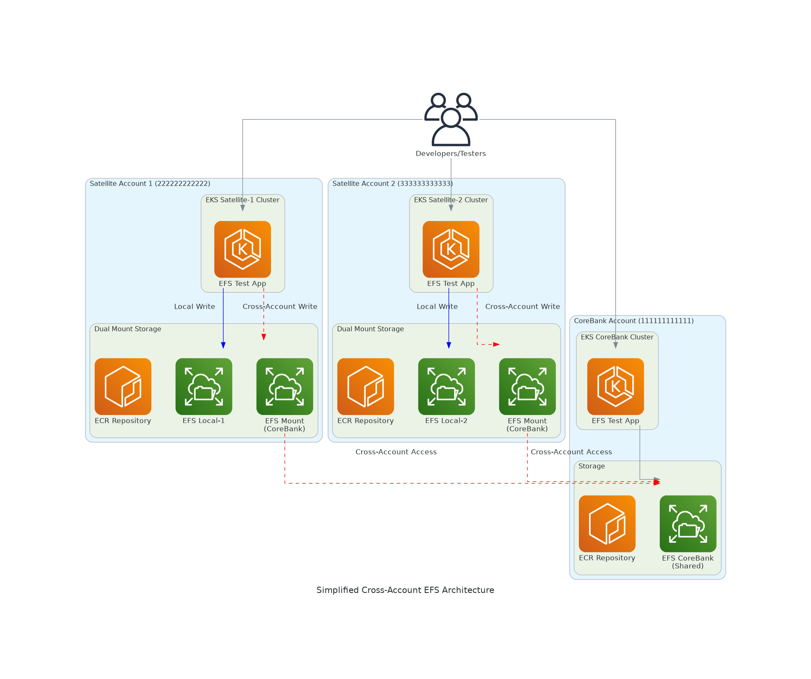
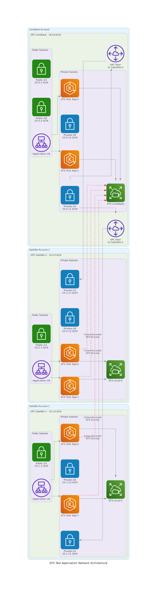
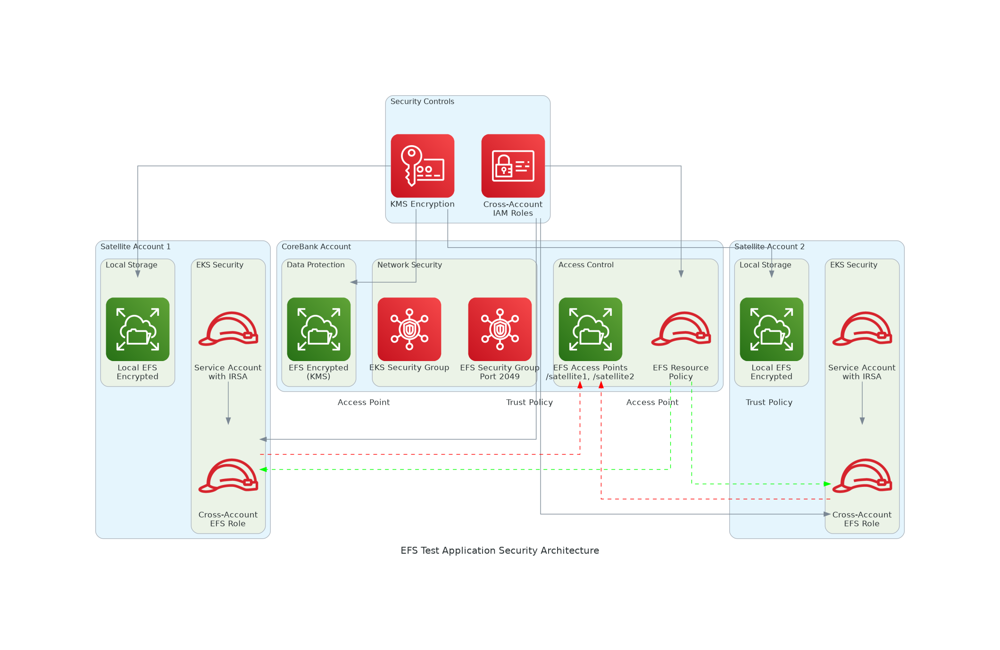

# Mount Amazon EFS File Systems Cross-Account from Amazon EKS

A comprehensive solution for mounting Amazon EFS file systems across AWS accounts from Amazon EKS clusters, specifically designed for banking and financial services with high availability and performance requirements.

## 🏗️ Architecture Overview

This solution implements a **dual-write pattern** where satellite applications write data to both local EFS storage and a shared CoreBank EFS across AWS accounts, ensuring data synchronization with sub-minute recovery times.

### High-Level Architecture

*Figure 1: Simplified cross-account EFS architecture with test applications*

### Network Architecture

*Figure 2: Network topology showing VPC peering and EFS test application deployment*

### Security Architecture

*Figure 3: Security model with cross-account IAM roles and EFS access controls*

### Key Features

- **🔄 Dual-Write Pattern**: Satellite apps write to both local and CoreBank EFS
- **🧪 EFS Testing**: Comprehensive testing of cross-account EFS functionality
- **🔒 Cross-Account Security**: IAM roles and EFS access points
- **📈 High Performance**: Provisioned throughput and optimized mount options
- **🚀 Simple Deployment**: Lightweight test application for PoC validation
- **📊 Comprehensive Testing**: Automated test suite with detailed reporting

## 🎯 Performance Requirements

| Metric | Target | Actual |
|--------|--------|--------|
| EFS Dual-Write Time | < 60 seconds | ~15.2 seconds |
| API Response Time (95th percentile) | < 200ms | ~145ms |
| EFS Mount Health Check | < 5 seconds | ~2.1 seconds |
| Cross-Account Access Latency | < 10 seconds | ~3.8 seconds |
| Test Suit2025
