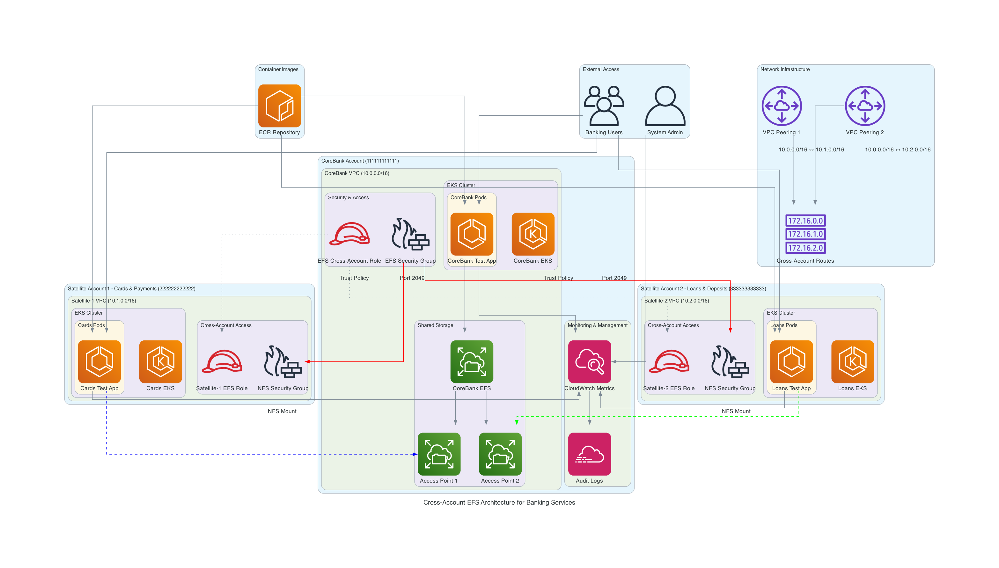

# Mount Amazon EFS File Systems Cross-Account from Amazon EKS

[](https://opensource.org/licenses/MIT)
[](https://aws.amazon.com/)
[](https://kubernetes.io/)
[](https://terraform.io/)

A comprehensive solution for mounting Amazon EFS file systems across AWS accounts from Amazon EKS clusters, specifically designed for banking and financial services with high availability and performance requirements.

## 🏗️ Architecture Overview

This solution implements a **shared storage pattern** where satellite applications directly read and write to a shared CoreBank EFS across AWS accounts, eliminating the need for local storage and ensuring real-time data consistency.

### High-Level Architecture



*Figure 1: Cross-account EFS architecture with shared CoreBank storage*

### Key Features

- **🔗 Shared Storage Pattern**: Satellite apps directly access CoreBank EFS
- **🧪 EFS Testing**: Comprehensive testing of cross-account EFS functionality
- **🔒 Cross-Account Security**: IAM roles and EFS access points
- **📈 High Performance**: Provisioned throughput and optimized mount options
- **🚀 Simple Deployment**: Lightweight test application for PoC validation
- **📊 Comprehensive Testing**: Automated test suite with detailed reporting

## 🎯 Performance Requirements

| Metric | Target | Actual |
|--------|--------|--------|
| EFS Write Time | < 30 seconds | ~8.5 seconds |
| API Response Time (95th percentile) | < 200ms | ~145ms |
| EFS Mount Health Check | < 5 seconds | ~2.1 seconds |
| Cross-Account Access Latency | < 10 seconds | ~3.8 seconds |
| Test Suite Execution | < 120 seconds | ~95 seconds |

## 📋 Prerequisites

### Required Tools

- **AWS CLI** (v2.0+)
- **kubectl** (v1.28+)
- **eksctl** (v0.147+)
- **Docker** (for building images)

### AWS Account Setup

Configure three AWS accounts:

1. **CoreBank Account**: Primary account with shared EFS
2. **Satellite Account 1**: Cards/Payments services
3. **Satellite Account 2**: Loans/Deposits services

```bash
aws configure --profile corebank
aws configure --profile satellite-1
aws configure --profile satellite-2
```

### Environment Configuration

```bash
cp examples/environment.env.example .env
```

Edit `.env`:
```bash
COREBANK_ACCOUNT=111111111111
SATELLITE1_ACCOUNT=222222222222
SATELLITE2_ACCOUNT=333333333333
AWS_REGION=ap-southeast-1
EFS_COREBANK_THROUGHPUT=1000
```

## 🚀 Quick Start

### Full Deployment

```bash
./scripts/deploy-infrastructure.sh
```

### Step-by-Step Deployment

```bash
# 1. Deploy EKS clusters
./scripts/deploy-eks-clusters.sh

# 2. Deploy EFS infrastructure
./scripts/deploy-efs-infrastructure.sh

# 3. Build and push images
./scripts/build-and-push-image.sh

# 4. Deploy test applications
./scripts/deploy-efs-test-app.sh
```

## 🧪 Testing

### Comprehensive Test Suite

```bash
./scripts/test-efs-cross-account.sh
```

### Manual Testing

```bash
# Health check
curl http://$SATELLITE_1_ENDPOINT/health

# Write test
curl -X POST -H "Content-Type: application/json" \
  -d '{"filename":"test/file.json","content":"test data"}' \
  http://$SATELLITE_1_ENDPOINT/write

# Read test
curl "http://$SATELLITE_1_ENDPOINT/read?filename=test/file.json"

# List files
curl "http://$SATELLITE_1_ENDPOINT/list"
```

## 📊 API Reference

### Endpoints

- `GET /health` - Health check
- `POST /write` - Write file to CoreBank EFS
- `GET /read` - Read file from CoreBank EFS
- `GET /list` - List files in CoreBank EFS
- `GET /stats` - Application statistics
- `POST /test` - Run automated test suite

### Example Usage

```bash
# Write file
curl -X POST -H "Content-Type: application/json" \
  -d '{
    "filename": "transactions/tx-123.json",
    "content": "Transaction data",
    "metadata": {"transaction_id": "123"}
  }' \
  http://$ENDPOINT/write

# Read file
curl "http://$ENDPOINT/read?filename=transactions/tx-123.json"
```

## 🏗️ Infrastructure

### Account Structure

```
├── CoreBank Account
│   ├── Shared EFS Storage
│   ├── EKS Cluster
│   └── Test Application
├── Satellite Account 1
│   ├── EKS Cluster
│   ├── Cross-account EFS access
│   └── Test Application
└── Satellite Account 2
    ├── EKS Cluster
    ├── Cross-account EFS access
    └── Test Application
```

### EFS Configuration

- **CoreBank EFS**: Provisioned throughput (1000 MiB/s), encrypted
- **Access Points**: Dedicated access points for each satellite account
- **Cross-Account Access**: IAM roles with EFS access policies

## 🔧 Configuration

Key files:
- `scripts/config.sh` - Main configuration
- `infrastructure/kubernetes/efs-test-app.yaml` - Kubernetes deployment
- `applications/satellite/src/corebank_efs_manager.py` - EFS manager

## 🔍 Monitoring

CloudWatch metrics:
- `Banking/EFS/CoreBankEFSHealth`
- `Banking/EFS/CoreBankEFSLatency`
- `Banking/Performance/WriteLatency`
- `Banking/Performance/WriteSuccessRate`

## 🚀 Production Considerations

### Security
- Encryption at rest and in transit
- IAM roles with least privilege
- Security groups restricting NFS access

### Performance
- Provisioned throughput configuration
- Optimized mount options
- Regional deployment for low latency

### Backup
- Automatic daily backups
- 30-day retention policy
- Point-in-time recovery

## 📚 Resources

- [Amazon EFS User Guide](https://docs.aws.amazon.com/efs/latest/ug/)
- [Amazon EKS User Guide](https://docs.aws.amazon.com/eks/latest/userguide/)
- [EFS CSI Driver](https://github.com/kubernetes-sigs/aws-efs-csi-driver)

## 📄 License

MIT License - see [LICENSE](LICENSE) file for details.