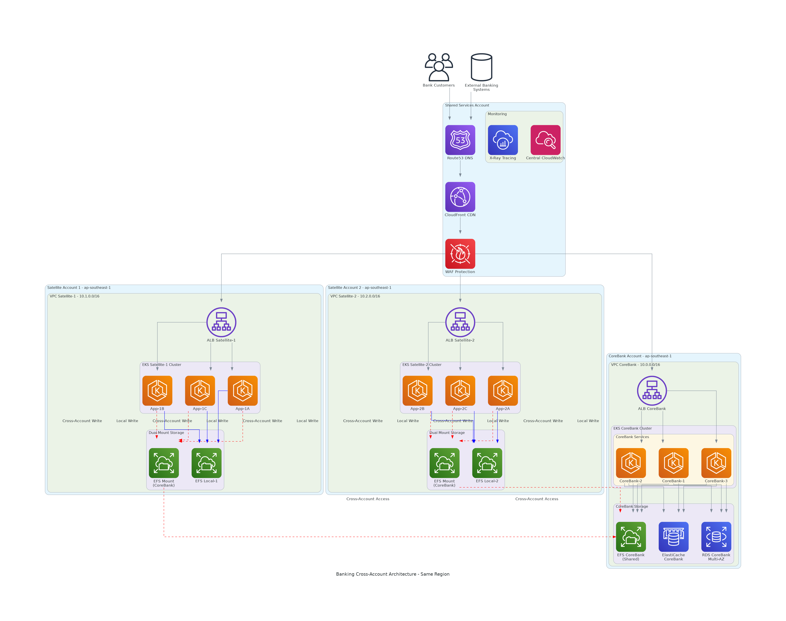
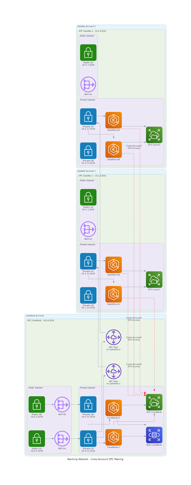
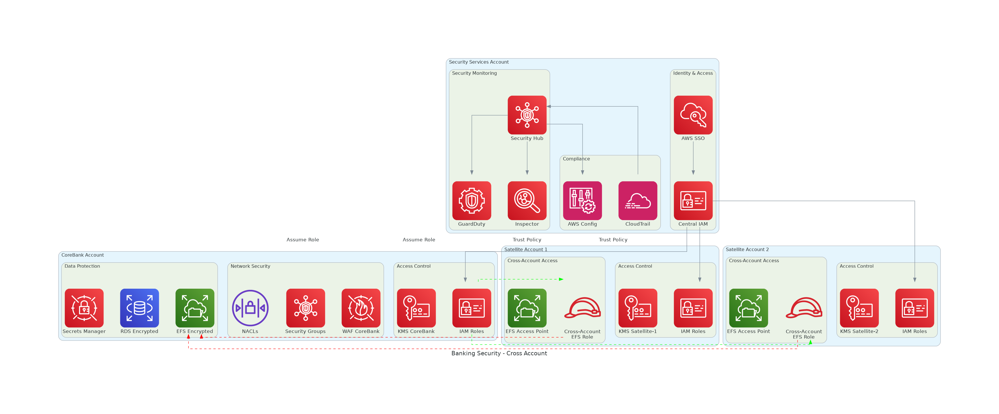

# Infrastructure Requirements

## Overview

This document outlines the complete infrastructure requirements for deploying the cross-account Amazon EFS solution for banking applications.

## Architecture Diagrams

### High-Level Architecture


*Figure 1: Complete cross-account architecture showing the dual-write pattern between CoreBank and Satellite accounts*

### Network Architecture


*Figure 2: Network topology with VPC peering connections and security group configurations*

### Security Architecture


*Figure 3: Cross-account security model with IAM roles and access controls*

## AWS Account Structure

### Account Hierarchy

```
Organization Root
├── CoreBank Account (111111111111)
│   ├── Production Environment
│   ├── Shared EFS Storage
│   ├── Central Database (RDS)
│   └── Caching Layer (ElastiCache)
├── Satellite Account 1 (222222222222)
│   ├── Cards & Payments Services
│   ├── Local EFS Storage
│   └── Application Workloads
├── Satellite Account 2 (333333333333)
│   ├── Loans & Deposits Services
│   ├── Local EFS Storage
│   └── Application Workloads
└── Shared Services Account (444444444444) [Optional]
    ├── DNS & Route53
    ├── Monitoring & Logging
    └── Security Services
```

### Account Responsibilities

| Account | Purpose | Key Resources |
|---------|---------|---------------|
| CoreBank | Core banking services and shared storage | EFS (shared), RDS, ElastiCache, EKS |
| Satellite-1 | Cards and payment processing | EFS (local), EKS, Cross-account access |
| Satellite-2 | Loans and deposit services | EFS (local), EKS, Cross-account access |
| Shared Services | Common services (optional) | Route53, CloudWatch, Security Hub |

## Network Infrastructure

### VPC Configuration

#### CoreBank VPC (10.0.0.0/16)

```yaml
VPC Configuration:
  CIDR: 10.0.0.0/16
  Region: ap-southeast-1
  Availability Zones: 3 (1a, 1b, 1c)
  DNS Hostnames: Enabled
  DNS Resolution: Enabled

Subnets:
  Public Subnets:
    - Name: CoreBank-Public-1A
      CIDR: 10.0.1.0/24
      AZ: ap-southeast-1a
      Resources: NAT Gateway, ALB
    - Name: CoreBank-Public-1B
      CIDR: 10.0.2.0/24
      AZ: ap-southeast-1b
      Resources: NAT Gateway, ALB
    - Name: CoreBank-Public-1C
      CIDR: 10.0.3.0/24
      AZ: ap-southeast-1c
      Resources: NAT Gateway, ALB

  Private App Subnets:
    - Name: CoreBank-App-1A
      CIDR: 10.0.11.0/24
      AZ: ap-southeast-1a
      Resources: EKS Nodes
    - Name: CoreBank-App-1B
      CIDR: 10.0.12.0/24
      AZ: ap-southeast-1b
      Resources: EKS Nodes
    - Name: CoreBank-App-1C
      CIDR: 10.0.13.0/24
      AZ: ap-southeast-1c
      Resources: EKS Nodes

  Private DB Subnets:
    - Name: CoreBank-DB-1A
      CIDR: 10.0.21.0/24
      AZ: ap-southeast-1a
      Resources: RDS, ElastiCache
    - Name: CoreBank-DB-1B
      CIDR: 10.0.22.0/24
      AZ: ap-southeast-1b
      Resources: RDS, ElastiCache
    - Name: CoreBank-DB-1C
      CIDR: 10.0.23.0/24
      AZ: ap-southeast-1c
      Resources: RDS, ElastiCache

  EFS Subnets:
    - Name: CoreBank-EFS-1A
      CIDR: 10.0.31.0/24
      AZ: ap-southeast-1a
      Resources: EFS Mount Targets
    - Name: CoreBank-EFS-1B
      CIDR: 10.0.32.0/24
      AZ: ap-southeast-1b
      Resources: EFS Mount Targets
    - Name: CoreBank-EFS-1C
      CIDR: 10.0.33.0/24
      AZ: ap-southeast-1c
      Resources: EFS Mount Targets
```

#### Satellite VPCs

```yaml
Satellite-1 VPC (10.1.0.0/16):
  Public Subnets:
    - 10.1.1.0/24 (AZ-1a)
    - 10.1.2.0/24 (AZ-1b)
  Private Subnets:
    - 10.1.11.0/24 (AZ-1a) - EKS Nodes
    - 10.1.12.0/24 (AZ-1b) - EKS Nodes
  EFS Subnets:
    - 10.1.31.0/24 (AZ-1a) - EFS Mount Targets
    - 10.1.32.0/24 (AZ-1b) - EFS Mount Targets

Satellite-2 VPC (10.2.0.0/16):
  Public Subnets:
    - 10.2.1.0/24 (AZ-1a)
    - 10.2.2.0/24 (AZ-1b)
  Private Subnets:
    - 10.2.11.0/24 (AZ-1a) - EKS Nodes
    - 10.2.12.0/24 (AZ-1b) - EKS Nodes
  EFS Subnets:
    - 10.2.31.0/24 (AZ-1a) - EFS Mount Targets
    - 10.2.32.0/24 (AZ-1b) - EFS Mount Targets
```

### VPC Peering Requirements

```yaml
Peering Connections:
  CoreBank-to-Satellite1:
    Requester VPC: CoreBank VPC (10.0.0.0/16)
    Accepter VPC: Satellite-1 VPC (10.1.0.0/16)
    Status: Active
    DNS Resolution: Enabled

  CoreBank-to-Satellite2:
    Requester VPC: CoreBank VPC (10.0.0.0/16)
    Accepter VPC: Satellite-2 VPC (10.2.0.0/16)
    Status: Active
    DNS Resolution: Enabled

Route Table Updates:
  CoreBank Routes:
    - Destination: 10.1.0.0/16, Target: pcx-satellite1
    - Destination: 10.2.0.0/16, Target: pcx-satellite2
  
  Satellite-1 Routes:
    - Destination: 10.0.0.0/16, Target: pcx-satellite1
  
  Satellite-2 Routes:
    - Destination: 10.0.0.0/16, Target: pcx-satellite2
```

## Compute Infrastructure

### EKS Cluster Specifications

#### CoreBank EKS Cluster

```yaml
Cluster Configuration:
  Name: corebank-cluster
  Version: 1.28
  Region: ap-southeast-1
  Endpoint Access: Private
  Logging: All types enabled
  
Node Groups:
  Primary Node Group:
    Name: corebank-nodes-primary
    Instance Types: [c5.xlarge]
    AMI Type: AL2_x86_64
    Capacity Type: ON_DEMAND
    Scaling:
      Min Size: 3
      Max Size: 10
      Desired Size: 6
    
    Instance Configuration:
      vCPU: 4
      Memory: 8 GiB
      Network Performance: Up to 10 Gbps
      EBS Optimized: Yes
    
    Storage:
      Volume Type: gp3
      Volume Size: 100 GiB
      IOPS: 3000
      Throughput: 125 MiB/s
    
    Networking:
      Subnets: Private App Subnets
      Security Groups: EKS Node Security Group
    
    Labels:
      role: corebank
      environment: production
      tier: application
    
    Taints: []
    
    Tags:
      Environment: production
      Service: corebank
      CostCenter: banking-infrastructure
      Backup: required

Add-ons:
  - Name: vpc-cni
    Version: latest
    Configuration: Default
  - Name: coredns
    Version: latest
    Configuration: Default
  - Name: kube-proxy
    Version: latest
    Configuration: Default
  - Name: aws-efs-csi-driver
    Version: latest
    Configuration: Default
  - Name: aws-load-balancer-controller
    Version: latest
    Configuration: Default

IAM Roles:
  Cluster Service Role:
    Policies:
      - AmazonEKSClusterPolicy
  
  Node Group Role:
    Policies:
      - AmazonEKSWorkerNodePolicy
      - AmazonEKS_CNI_Policy
      - AmazonEC2ContainerRegistryReadOnly
      - AmazonElasticFileSystemClientFullAccess
      - CloudWatchAgentServerPolicy
```

#### Satellite EKS Clusters

```yaml
Cluster Configuration:
  Names: [satellite-1-cluster, satellite-2-cluster]
  Version: 1.28
  Region: ap-southeast-1
  Endpoint Access: Private
  Logging: All types enabled

Node Groups:
  Primary Node Group:
    Name: satellite-nodes-primary
    Instance Types: [c5.large]
    AMI Type: AL2_x86_64
    Capacity Type: ON_DEMAND
    Scaling:
      Min Size: 2
      Max Size: 6
      Desired Size: 3
    
    Instance Configuration:
      vCPU: 2
      Memory: 4 GiB
      Network Performance: Up to 10 Gbps
      EBS Optimized: Yes
    
    Storage:
      Volume Type: gp3
      Volume Size: 50 GiB
      IOPS: 3000
      Throughput: 125 MiB/s
    
    Labels:
      role: satellite
      environment: production
      tier: application
    
    Tags:
      Environment: production
      Service: satellite
      CostCenter: banking-infrastructure

Add-ons:
  - Name: vpc-cni
    Version: latest
  - Name: coredns
    Version: latest
  - Name: kube-proxy
    Version: latest
  - Name: aws-efs-csi-driver
    Version: latest
```

### EC2 Instance Requirements

| Component | Instance Type | vCPU | Memory | Network | Storage | Count |
|-----------|---------------|------|--------|---------|---------|-------|
| CoreBank Nodes | c5.xlarge | 4 | 8 GiB | Up to 10 Gbps | 100 GiB gp3 | 6 |
| Satellite-1 Nodes | c5.large | 2 | 4 GiB | Up to 10 Gbps | 50 GiB gp3 | 3 |
| Satellite-2 Nodes | c5.large | 2 | 4 GiB | Up to 10 Gbps | 50 GiB gp3 | 3 |

## Storage Infrastructure

### EFS Configuration

#### CoreBank EFS (Shared)

```yaml
File System Configuration:
  Name: CoreBank-Shared-EFS
  Performance Mode: General Purpose
  Throughput Mode: Provisioned
  Provisioned Throughput: 1000 MiB/s
  Encryption:
    At Rest: Enabled
    In Transit: Enabled
    KMS Key: Customer Managed
  
  Backup:
    Automatic Backups: Enabled
    Backup Vault: Default
    Retention: 30 days
  
  Lifecycle Management:
    Transition to IA: 30 days
    Transition to Archive: 90 days

Mount Targets:
  - Subnet: CoreBank-EFS-1A (10.0.31.0/24)
    IP Address: 10.0.31.10
    Security Group: sg-efs-corebank
  - Subnet: CoreBank-EFS-1B (10.0.32.0/24)
    IP Address: 10.0.32.10
    Security Group: sg-efs-corebank
  - Subnet: CoreBank-EFS-1C (10.0.33.0/24)
    IP Address: 10.0.33.10
    Security Group: sg-efs-corebank

Access Points:
  Satellite-1 Access Point:
    Name: Satellite1-AccessPoint
    Path: /satellite1
    POSIX User:
      UID: 1001
      GID: 1001
    Root Directory:
      Path: /satellite1
      Owner UID: 1001
      Owner GID: 1001
      Permissions: 755
  
  Satellite-2 Access Point:
    Name: Satellite2-AccessPoint
    Path: /satellite2
    POSIX User:
      UID: 1002
      GID: 1002
    Root Directory:
      Path: /satellite2
      Owner UID: 1002
      Owner GID: 1002
      Permissions: 755
```

#### Satellite Local EFS

```yaml
Satellite-1 EFS:
  Name: Satellite1-Local-EFS
  Performance Mode: General Purpose
  Throughput Mode: Provisioned
  Provisioned Throughput: 500 MiB/s
  Encryption: Enabled
  Backup: Enabled

Satellite-2 EFS:
  Name: Satellite2-Local-EFS
  Performance Mode: General Purpose
  Throughput Mode: Provisioned
  Provisioned Throughput: 500 MiB/s
  Encryption: Enabled
  Backup: Enabled
```

### Database Requirements

#### RDS PostgreSQL

```yaml
Instance Configuration:
  Identifier: corebank-primary
  Engine: PostgreSQL
  Version: 15.4
  Instance Class: db.r5.xlarge
  
  Specifications:
    vCPU: 4
    Memory: 32 GiB
    Network Performance: Up to 10 Gbps
  
  Storage:
    Type: gp3
    Size: 500 GiB
    IOPS: 10000
    Throughput: 1000 MiB/s
    Encrypted: Yes
    KMS Key: Customer Managed
  
  Multi-AZ: Enabled
  
  Backup:
    Retention Period: 7 days
    Backup Window: 03:00-04:00 UTC
    Copy Tags to Snapshots: Yes
    Delete Automated Backups: No
  
  Maintenance:
    Window: sun:04:00-sun:05:00 UTC
    Auto Minor Version Upgrade: No
  
  Monitoring:
    Performance Insights: Enabled
    Retention Period: 7 days
    Enhanced Monitoring: Enabled
    Monitoring Interval: 60 seconds
  
  Security:
    VPC Security Groups: [sg-rds-corebank]
    DB Subnet Group: corebank-db-subnet-group
    Publicly Accessible: No
    Deletion Protection: Yes

Parameter Group:
  Name: corebank-postgres-params
  Parameters:
    max_connections: 2000
    shared_buffers: 8GB
    effective_cache_size: 24GB
    work_mem: 64MB
    maintenance_work_mem: 2GB
    checkpoint_completion_target: 0.9
    wal_buffers: 64MB
    default_statistics_target: 500
    random_page_cost: 1.1
    effective_io_concurrency: 200
    log_statement: all
    log_duration: on
    log_checkpoints: on
    log_connections: on
    log_disconnections: on

Read Replicas:
  Count: 2
  Instance Class: db.r5.large
  Multi-AZ: No
  Auto Minor Version Upgrade: No
```

#### ElastiCache Redis

```yaml
Replication Group:
  Name: corebank-redis
  Description: CoreBank Redis Cluster
  Engine: Redis
  Version: 7.0
  Port: 6379
  
  Node Configuration:
    Node Type: cache.r6g.large
    Specifications:
      vCPU: 2
      Memory: 12.32 GiB
      Network Performance: Up to 10 Gbps
  
  Cluster Configuration:
    Num Cache Clusters: 3
    Num Node Groups: 3
    Replicas Per Node Group: 2
    Total Nodes: 9
    Total Memory: ~111 GiB
  
  Security:
    Subnet Group: corebank-cache-subnet-group
    Security Groups: [sg-elasticache-corebank]
    At Rest Encryption: Enabled
    In Transit Encryption: Enabled
    Auth Token: Enabled
  
  Backup:
    Snapshot Retention: 5 days
    Snapshot Window: 05:00-07:00 UTC
    Final Snapshot: Yes
  
  Maintenance:
    Window: sun:06:00-sun:07:00 UTC
    Auto Minor Version Upgrade: No

Parameter Group:
  Name: corebank-redis-params
  Parameters:
    maxmemory-policy: allkeys-lru
    timeout: 300
    tcp-keepalive: 60
    save: "900 1 300 10 60 10000"
    maxclients: 10000
```

## Security Infrastructure

### Security Groups

#### EFS Security Group

```yaml
Name: sg-efs-corebank
Description: Security group for CoreBank EFS
VPC: CoreBank VPC

Inbound Rules:
  - Type: NFS
    Protocol: TCP
    Port: 2049
    Source: 10.0.0.0/16 (CoreBank VPC)
    Description: NFS access from CoreBank VPC
  - Type: NFS
    Protocol: TCP
    Port: 2049
    Source: 10.1.0.0/16 (Satellite-1 VPC)
    Description: NFS access from Satellite-1 VPC
  - Type: NFS
    Protocol: TCP
    Port: 2049
    Source: 10.2.0.0/16 (Satellite-2 VPC)
    Description: NFS access from Satellite-2 VPC

Outbound Rules:
  - Type: All Traffic
    Protocol: All
    Port: All
    Destination: 0.0.0.0/0
    Description: All outbound traffic
```

#### EKS Node Security Group

```yaml
Name: sg-eks-nodes-corebank
Description: Security group for CoreBank EKS nodes
VPC: CoreBank VPC

Inbound Rules:
  - Type: All Traffic
    Protocol: All
    Port: All
    Source: sg-eks-nodes-corebank
    Description: Inter-node communication
  - Type: HTTPS
    Protocol: TCP
    Port: 443
    Source: sg-eks-control-plane
    Description: EKS control plane communication
  - Type: Custom TCP
    Protocol: TCP
    Port: 10250
    Source: sg-eks-control-plane
    Description: Kubelet API

Outbound Rules:
  - Type: All Traffic
    Protocol: All
    Port: All
    Destination: 0.0.0.0/0
    Description: All outbound traffic
```

#### RDS Security Group

```yaml
Name: sg-rds-corebank
Description: Security group for CoreBank RDS
VPC: CoreBank VPC

Inbound Rules:
  - Type: PostgreSQL
    Protocol: TCP
    Port: 5432
    Source: sg-eks-nodes-corebank
    Description: Database access from EKS nodes

Outbound Rules: []
```

#### ElastiCache Security Group

```yaml
Name: sg-elasticache-corebank
Description: Security group for CoreBank ElastiCache
VPC: CoreBank VPC

Inbound Rules:
  - Type: Custom TCP
    Protocol: TCP
    Port: 6379
    Source: sg-eks-nodes-corebank
    Description: Redis access from EKS nodes

Outbound Rules: []
```

### Network ACLs

```yaml
CoreBank VPC NACL:
  Inbound Rules:
    100: Allow HTTP (80) from 0.0.0.0/0
    110: Allow HTTPS (443) from 0.0.0.0/0
    120: Allow SSH (22) from 10.0.0.0/16
    130: Allow NFS (2049) from 10.1.0.0/16
    140: Allow NFS (2049) from 10.2.0.0/16
    150: Allow Ephemeral (1024-65535) from 0.0.0.0/0
    32767: Deny All from 0.0.0.0/0

  Outbound Rules:
    100: Allow All Traffic to 0.0.0.0/0
    32767: Deny All to 0.0.0.0/0
```

## Monitoring Infrastructure

### CloudWatch Configuration

#### Log Groups

```yaml
Required Log Groups:
  Application Logs:
    - Name: /aws/eks/corebank-cluster/cluster
      Retention: 30 days
      KMS Encryption: Enabled
    - Name: /aws/eks/satellite-1-cluster/cluster
      Retention: 30 days
      KMS Encryption: Enabled
    - Name: /aws/eks/satellite-2-cluster/cluster
      Retention: 30 days
      KMS Encryption: Enabled
    - Name: /banking/application
      Retention: 30 days
      KMS Encryption: Enabled

  Performance Logs:
    - Name: /banking/performance
      Retention: 7 days
      KMS Encryption: Enabled
    - Name: /banking/dual-write
      Retention: 7 days
      KMS Encryption: Enabled

  Audit Logs:
    - Name: /banking/audit
      Retention: 2555 days  # 7 years
      KMS Encryption: Enabled
    - Name: /banking/security
      Retention: 2555 days  # 7 years
      KMS Encryption: Enabled
```

#### Custom Metrics

```yaml
Namespaces:
  Banking/Performance:
    Metrics:
      - DualWriteLatency (Milliseconds)
      - APIResponseTime (Milliseconds)
      - ThroughputTPS (Count/Second)
      - ErrorRate (Percent)

  Banking/EFS:
    Metrics:
      - CrossAccountLatency (Milliseconds)
      - LocalWriteLatency (Milliseconds)
      - SyncSuccessRate (Percent)
      - MountFailures (Count)

  Banking/Application:
    Metrics:
      - ActiveConnections (Count)
      - QueueDepth (Count)
      - ProcessingTime (Milliseconds)
      - MemoryUtilization (Percent)

  Banking/Security:
    Metrics:
      - FailedLogins (Count)
      - UnauthorizedAccess (Count)
      - SecurityAlerts (Count)
      - ComplianceViolations (Count)
```

#### Alarms

```yaml
Critical Alarms:
  EFS-ThroughputUtilization-High:
    Metric: AWS/EFS/ThroughputUtilization
    Threshold: 80
    Comparison: GreaterThanThreshold
    Evaluation Periods: 2
    Period: 300
    Statistic: Average
    Actions: [SNS Topic: banking-critical-alerts]

  DualWrite-Latency-High:
    Metric: Banking/Performance/DualWriteLatency
    Threshold: 30000  # 30 seconds
    Comparison: GreaterThanThreshold
    Evaluation Periods: 2
    Period: 60
    Statistic: Average
    Actions: [SNS Topic: banking-critical-alerts]

  API-ResponseTime-High:
    Metric: Banking/Performance/APIResponseTime
    Threshold: 500
    Comparison: GreaterThanThreshold
    Evaluation Periods: 3
    Period: 60
    Statistic: Average
    Actions: [SNS Topic: banking-warning-alerts]

Warning Alarms:
  EKS-Node-CPU-High:
    Metric: AWS/EC2/CPUUtilization
    Threshold: 80
    Comparison: GreaterThanThreshold
    Evaluation Periods: 3
    Period: 300
    Statistic: Average
    Actions: [SNS Topic: banking-warning-alerts]

  EKS-Node-Memory-High:
    Metric: CWAgent/mem_used_percent
    Threshold: 85
    Comparison: GreaterThanThreshold
    Evaluation Periods: 3
    Period: 300
    Statistic: Average
    Actions: [SNS Topic: banking-warning-alerts]
```

## Backup and Disaster Recovery

### Backup Strategy

```yaml
EFS Backup:
  Automatic Backups:
    Enabled: Yes
    Schedule: Daily at 02:00 UTC
    Retention: 30 days
    Vault: Default
    Lifecycle: 
      Delete After: 30 days
      Move to Cold Storage: 7 days

  Cross-Region Replication:
    Destination Region: ap-northeast-1
    Replication Configuration:
      Availability Class: Regional
      Performance Mode: General Purpose
      Throughput Mode: Provisioned (500 MiB/s)

RDS Backup:
  Automated Backups:
    Retention Period: 7 days
    Backup Window: 03:00-04:00 UTC
    Copy Tags to Snapshots: Yes
    Delete Automated Backups: No

  Manual Snapshots:
    Schedule: Weekly (Sunday 01:00 UTC)
    Retention: 30 days
    Cross-Region Copy: ap-northeast-1

Application Backup:
  Container Images:
    Registry: Amazon ECR
    Replication: Cross-region to ap-northeast-1
    Lifecycle Policy: Keep last 10 images

  Configuration:
    Storage: AWS Systems Manager Parameter Store
    Backup: Automated via AWS Backup
    Encryption: KMS encrypted
```

### Disaster Recovery Plan

```yaml
Recovery Objectives:
  RTO: < 60 seconds (automated failover)
  RPO: < 30 seconds (data loss tolerance)

Recovery Strategies:
  High Availability:
    Multi-AZ Deployment: All critical components
    Auto Scaling: Enabled for EKS node groups
    Load Balancer Health Checks: Enabled
    Database Failover: Automatic (Multi-AZ RDS)

  Backup and Restore:
    EFS Point-in-Time Recovery: Available
    RDS Point-in-Time Recovery: Available
    Application State Recovery: Stateless design

  Cross-Region Disaster Recovery:
    Infrastructure: Terraform templates
    Data Replication: EFS cross-region replication
    Database: Cross-region read replicas
    DNS Failover: Route53 health checks
```

## Cost Optimization

### Resource Right-Sizing

```yaml
Instance Optimization:
  Reserved Instances:
    Coverage: 70% of predictable workloads
    Term: 1 year, No Upfront
    Instance Types: c5.xlarge, c5.large

  Spot Instances:
    Usage: Development and testing environments
    Coverage: 30% of non-critical workloads
    Diversification: Multiple instance types

Storage Optimization:
  EFS Intelligent Tiering:
    Enabled: Yes
    Transition to IA: 30 days
    Transition to Archive: 90 days
    Estimated Savings: 20-30%

  EBS Optimization:
    Volume Type: gp3 (cost-effective)
    Right-sizing: Based on IOPS requirements
    Snapshot Lifecycle: Automated cleanup

Network Optimization:
  VPC Endpoints:
    Services: S3, ECR, CloudWatch, Systems Manager
    Type: Gateway and Interface endpoints
    Cost Savings: Reduced NAT Gateway usage

  Data Transfer:
    CloudFront: For static content delivery
    Direct Connect: For high-volume transfers (future)
```

### Cost Monitoring

```yaml
Budget Configuration:
  Monthly Budget: $6,000
  Alert Thresholds:
    - 50% of budget ($3,000)
    - 80% of budget ($4,800)
    - 100% of budget ($6,000)
    - 110% forecasted ($6,600)

Cost Allocation Tags:
  Required Tags:
    - Environment: production/staging/development
    - Service: corebank/satellite1/satellite2
    - Team: banking-infrastructure
    - CostCenter: IT-Banking
    - Owner: team-email@company.com
    - Project: cross-account-efs

Cost Optimization Reports:
  Frequency: Weekly
  Recipients: Infrastructure team, Finance team
  Content: 
    - Resource utilization
    - Cost trends
    - Optimization recommendations
    - Reserved Instance utilization
```

## Compliance Requirements

### Banking Regulations

```yaml
Data Residency:
  Requirement: All data must remain in ap-southeast-1
  Implementation:
    - No cross-border data transfer
    - Regional resource deployment only
    - Data sovereignty compliance

Audit Requirements:
  Logging:
    - All API calls (CloudTrail)
    - Database access (RDS logs)
    - File system access (EFS logs)
    - Application logs (CloudWatch)
  
  Retention:
    - Audit logs: 7 years (2555 days)
    - Transaction logs: 7 years
    - Security logs: 7 years
    - Performance logs: 30 days

Security Standards:
  Compliance Frameworks:
    - PCI DSS Level 1
    - ISO 27001
    - SOC 2 Type II
    - Local banking regulations

  Security Controls:
    - Encryption at rest and in transit
    - Multi-factor authentication
    - Role-based access control
    - Regular security assessments
    - Vulnerability scanning
    - Penetration testing
```

### Compliance Monitoring

```yaml
AWS Config Rules:
  Required Rules:
    - encrypted-volumes
    - root-access-key-check
    - mfa-enabled-for-iam-console-access
    - s3-bucket-ssl-requests-only
    - rds-storage-encrypted
    - efs-encrypted-check
    - vpc-flow-logs-enabled
    - cloudtrail-enabled

Security Hub:
  Standards:
    - AWS Foundational Security Standard
    - PCI DSS
    - CIS AWS Foundations Benchmark
  
  Findings:
    - Automatic remediation for low-risk findings
    - Alert for medium and high-risk findings
    - Weekly compliance reports

CloudTrail:
  Configuration:
    - All regions enabled
    - Management events: All
    - Data events: S3 and EFS
    - Insight events: Enabled
    - Log file validation: Enabled
    - KMS encryption: Enabled
```

This infrastructure specification provides the complete foundation for deploying the cross-account EFS solution with banking-grade security, performance, and compliance requirements.
